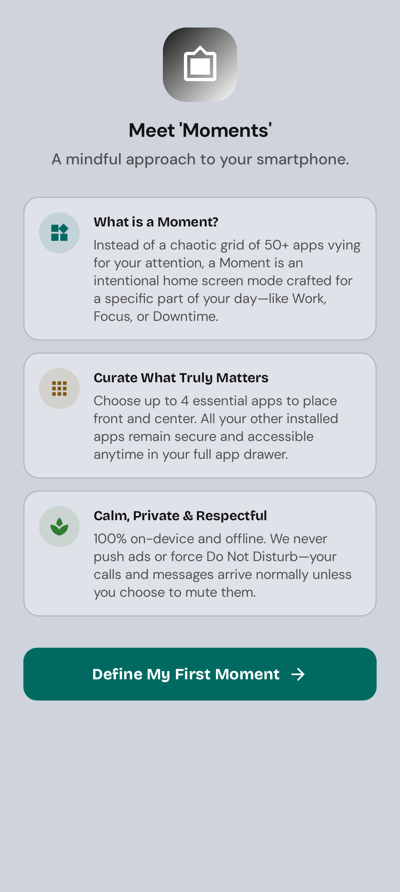
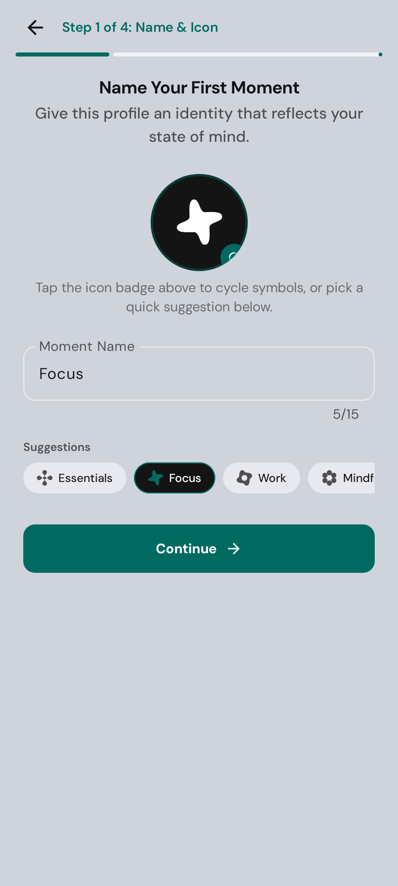
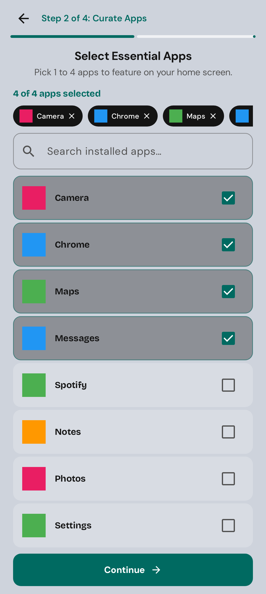
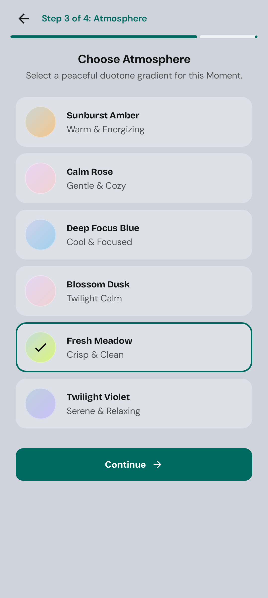
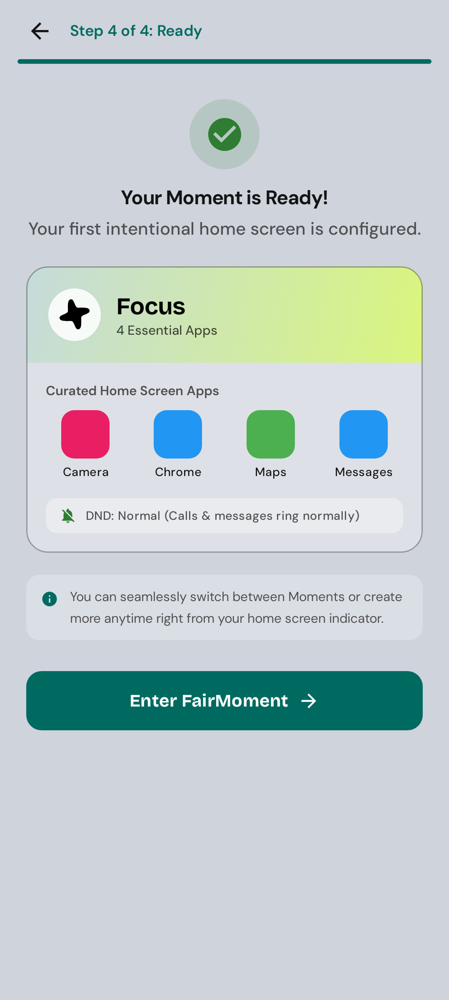
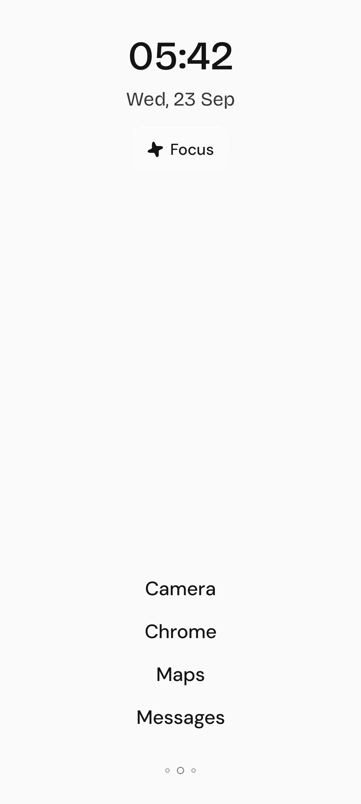
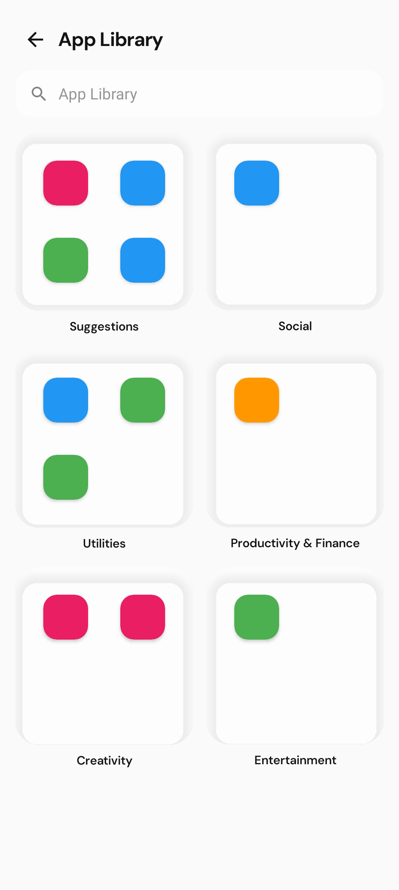
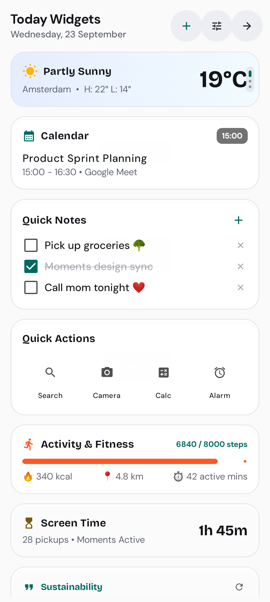

# 🌿 Spring Launcher (Fairphone Moments)

An intentional, calm, and distraction-free Android launcher designed to foster digital wellbeing. Powered by **Jetpack Compose**, **Material 3**, and modern Android architecture.

---

## 📸 Visual Showcase & Screenshots

### 🌟 1. Guided First-Launch Onboarding ("Moments")
Experience a calm, 5-step onboarding journey that introduces the concept of **Moments** and guides you through tailoring your initial focused profile before entering the home screen.

| Step 0: Meet Moments | Step 1: Name & Icon |
|:---:|:---:|
|  |  |
| **Mindful Phone Usage**<br/>Introduces the philosophy of context-aware profiles and offline-first privacy. | **Identity & Presets**<br/>Choose a moment name (e.g. Focus, Work, Evening) and custom iconography with quick suggestions. |

| Step 2: Curate Essential Apps | Step 3: Choose Atmosphere |
|:---:|:---:|
|  |  |
| **Distraction-Free Dock**<br/>Select only the tools needed for this specific state of mind, with real-time app search. | **Harmonious Color Gradients**<br/>Select custom background tones, ambient palettes, and accent gradients. |

| Step 4: Summary & Ready to Launch |
|:---:|
|  |
| **Ready for Focused Living**<br/>Review your curated moment profile and step straight into your newly personalized sanctuary. |

---

### 📱 2. Core Experience: Home Screen, App Library & Widgets

| Minimalist Home Screen | iOS-Style App Library | Today Widgets & Smart Stack |
|:---:|:---:|:---:|
|  |  |  |
| **Active Moment Pill & Clock**<br/>Calm layout featuring customized typography, dynamic date, and quick Moment switcher. | **Automatic Smart Categories**<br/>Organized folders (Suggestions, Social, Utilities, Productivity) with instant search. | **Glanceable Widgets**<br/>Live weather, calendar agenda, quick scratchpad, fitness stats, and digital wellbeing screen time. |

---

## ✨ Key Features

- **🎯 Contextual "Moments":** Switch seamlessly between work, leisure, study, and recharge modes. Each moment only displays the apps and contacts you need.
- **🌱 Distraction-Free Philosophy:** Reduces notification anxiety and compulsive app-opening with an intentional design language.
- **📂 Smart App Library:** iOS-inspired folder categorization automatically groups your applications into intuitive drawers with search.
- **📊 Today Widget Hub:** Quick-access widgets for daily schedule, weather forecast, quick notes, and screen-time monitoring right at your fingertips (swipe right from home).
- **🎨 Deep Customization:** Custom clock fonts (Bricolage, DM Sans, etc.), wallpaper blurring, dimming levels, and personalized gradient color themes.
- **🔒 100% Offline & Private:** Built with zero telemetry and complete on-device local storage.

---

## 🛠️ Architecture & Tech Stack

- **UI Framework:** [Jetpack Compose](https://developer.android.com/jetpack/compose) with Material Design 3 (M3)
- **Language:** 100% Kotlin with Coroutines & Flow
- **Dependency Injection:** [Koin](https://insert-koin.io/)
- **Data Persistence:** Android DataStore Preferences & Protocol Buffers
- **Screenshot Verification:** [Roborazzi](https://github.com/takahirom/roborazzi) + [Robolectric](https://robolectric.org/)

---

## 📂 Project Directory Structure

```
├── app/
│   ├── src/
│   │   ├── main/
│   │   │   ├── java/com/fairphone/spring/launcher/
│   │   │   │   ├── data/            # Repositories, models, preferences
│   │   │   │   ├── di/              # Koin dependency injection modules
│   │   │   │   ├── domain/          # Use cases & business logic
│   │   │   │   └── ui/              # Compose screens, widgets & themes
│   │   │   └── res/                 # Vector drawables, strings, colors
│   │   └── test/                    # Robolectric & Roborazzi screenshot tests
├── screenshots/                     # Application screenshots for GitHub & docs
│   ├── screenshot_1.png             # Step 0: Onboarding Concept
│   ├── screenshot_2.png             # Step 1: Name & Icon
│   ├── screenshot_3.png             # Step 2: Curate Apps
│   ├── screenshot_4.png             # Step 3: Atmosphere
│   ├── screenshot_5.png             # Step 4: Ready Summary
│   ├── screenshot_6.png             # Minimalist Home Screen
│   ├── screenshot_7.png             # iOS App Library
│   └── screenshot_8.png             # Today Widgets
└── README.md
```

---

## 🚀 Building & Testing

To compile the application:
```bash
./gradlew assembleDebug
```

To run unit and Roborazzi screenshot verification tests:
```bash
./gradlew testDebugUnitTest
```

To re-record screenshots:
```bash
./gradlew recordRoborazziDebug
```

---

*Fairphone Spring Launcher — Designed for peace of mind.*
